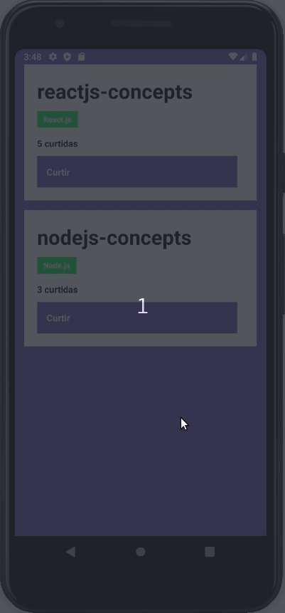

# react-native-concepts
Conceitos do React Native. Desafio da Bootcamp GoStack da Rocke

Este aplicativo mostra a implementação de uma lista de repositórios com a funcionalidade de "like". Você pode utiliza-la como interface de comnunicação com o servidor de repositórios **[deste repositório](https://github.com/marcelo-amorim/nodejs-concepts)**.

## :information_source: Sobre a aplicação

Esta interface ainda não está com todas as funcionalidades implementadas, mas já possui a funcionalidade de listagem e "likes" nos repositórios.

  

## :white_check_mark: Requisitos

 - Yarn - gerenciador de pacotes;
 - Node.js - versão 10 ou superior;

## Como rodar o projeto

Esta aplicação é apenas uma demonstração dos conceitos básicos do React Native. Para rodar o projeto basta clona-lo em um diretório de sua preferência e em seguida, executar o comando `yarn` no seu terminal.
Após a instalação das dependências, você deve realizar a instalação do app em seu emulador/dispositivo com o comando `yarn android` em dispositivos Android, ou `yarn ios` em dispositivos iOS.
Depois de instalação, o comando `yarn start` iniciará o aplicativo.

**Atenção**: Caso você esteja emulando no iOS, na pasta do seu projeto navegue até a pasta ios executando o comando `cd ios` e depois execute `pod install` para instalar todas as dependências para o iOS.

Todas as funcionalidades foram testadas, mas se quiser conferir o relatório de testes, execute o comando `yarn test` no terminal.

## TODOS
 - Implementar formulário de cadastro do repositório (título, url e tecnologias utilizadas);
 - Implementar container de exibição de mensagens;
 - Implementar remoção de repositórios;
